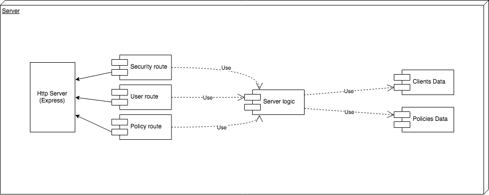
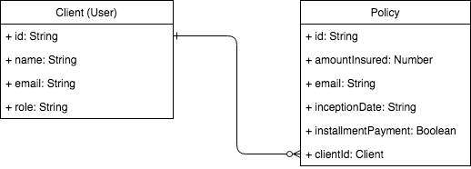

# Insurance company backend test

## Technologies

Typescript, NodeJs, Express, JWT, Webpack, TDD -Jest-

## Technical description

### Architecture

<!-- ### API

[API Documentation](https://documenter.getpostman.com/view/2257838/RWaKSo98)

 -->

### Data model

